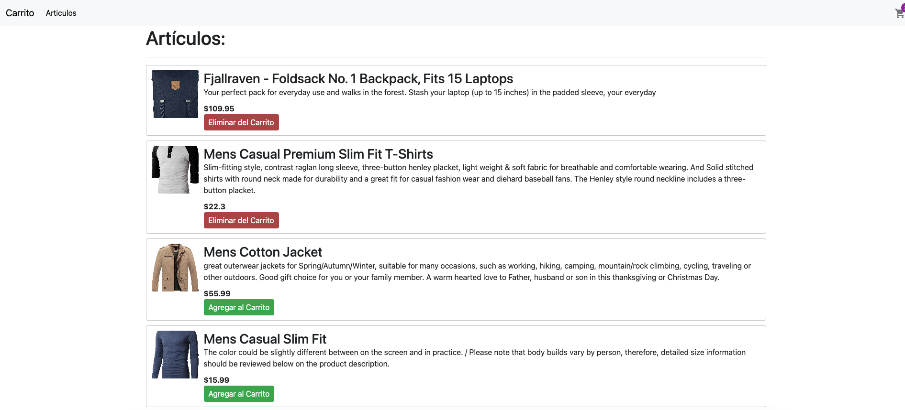
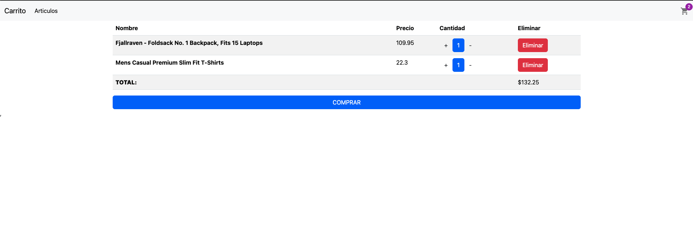

# Carrito de la Compra

Aplicación de carrito de la compra utiliza <a href="https://fakestoreapi.com/">fakestoreapi.com</a> para obtener los productos
esta aplicación utiliza <b>LocalStorage</b> del navegador para conservar los artículos añadidos al carrito.

 
  
   <h2> <a href="https://carrito-compras-samu.netlify.app/">Carrito de la Compra</a></h2>